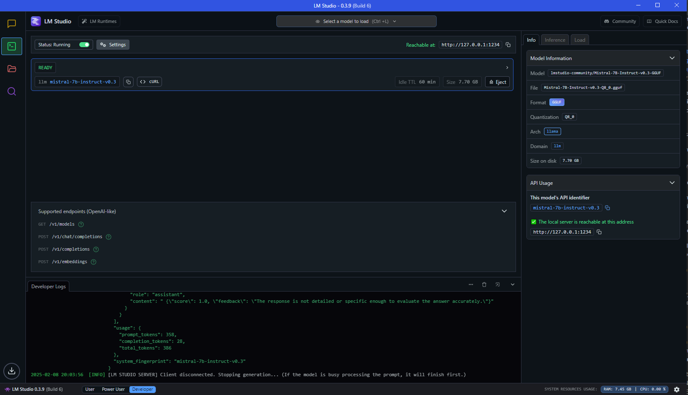

# Interview Quiz API

This project is an API built with FastAPI that powers an AI-driven interview workflow.
It provides endpoints to start an interview, submit responses, and complete the interview by saving a summary of the session. 
Additionally, a command-line client is provided to interact with the API.

## Prerequisites

- **Python:** Version 3.12
- **pip:** Python package installer
- (Optional) **Virtual Environment:** Tools such as `venv` or `virtualenv` are recommended.

## Installation

1. **Clone the Repository**

git clone https://github.com/abrudansergiu01/interview_test_api.git
cd interview_test_api

2. **Create a Virtual Environment (Recommended)**

On Linux/Mac:

python -m venv venv
source venv/bin/activate

On Windows:

python -m venv venv
venv\Scripts\activate

3. **Install Dependencies**

pip install -r requirements.txt

4. **Run the API**

uvicorn interview_test_api.main:interview_test_api --reload

5. **Run LM Studio**

Make sure you have LM Studio running on port 1234.

The following LLM model is required:
mistral-7b-instruct-v0.3

Check the following image:

6. **Run the Command-Line Client**

! ENSURE THE API IS RUNNING BEFORE RUNNING THE CLIENT !

Run the client with the following command:

python run_app.py

